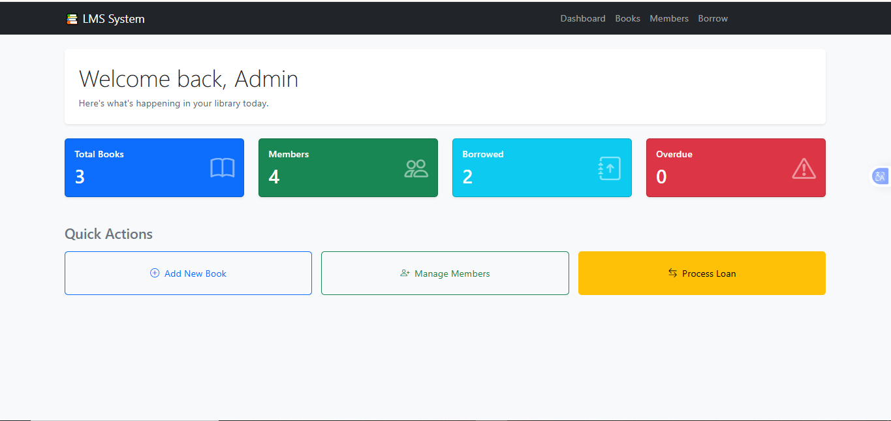
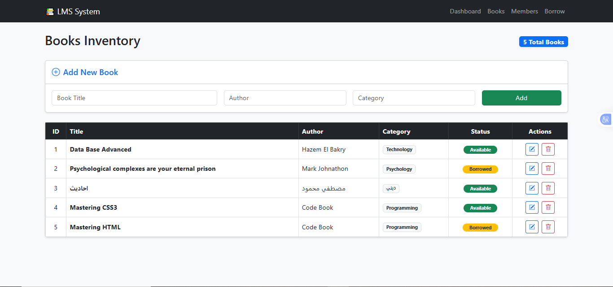
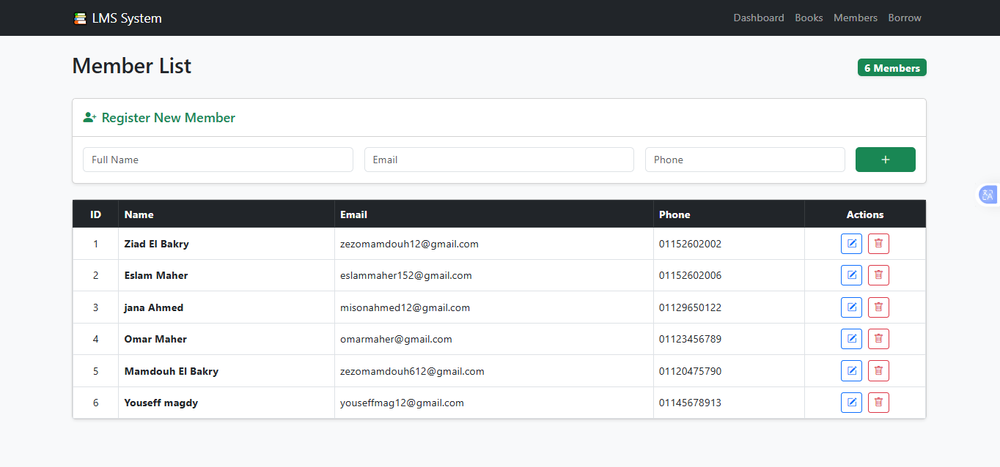
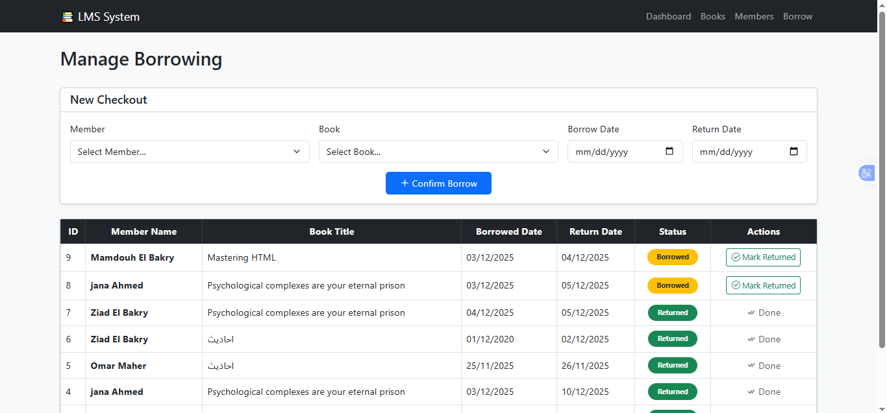

# 📚 Library Management System (LMS)

A robust and simple **Library Management System** built with **Node.js**, **Express**, and **MySQL**. This application helps librarians manage books, members, and borrowing transactions efficiently with a responsive dashboard.

---

(



)


## ✨ Features

### 🔹 Dashboard
- Real-time statistics: Total Books, Active Members, Borrowed Books, and Overdue Returns.
- Quick action buttons for common tasks.

### 🔹 Book Management 📖
- **Add New Books:** Register new books with title, author, and category.
- **View Inventory:** List all books with their current status (**Available** / **Borrowed**).
- **Edit/Delete:** Update book details or remove them from the system.
- **Auto-Status:** Book status updates automatically when borrowed or returned.

### 🔹 Member Management 👥
- **Register Members:** Add new library members with email and phone contact.
- **View/Edit/Delete:** Manage member profiles easily.

### 🔹 Borrowing System 🔄
- **Checkout Process:** Issue books to members with a specific return date.
- **Return Process:** Mark books as returned with a single click.
- **Overdue Detection:** Automatically flags transactions as **Overdue** (Red Badge) if the return date has passed.
- **Smart Validation:** Prevents borrowing books that are already out.

---

## 🛠️ Tech Stack

- **Backend:** Node.js, Express.js
- **Database:** MySQL
- **Frontend:** EJS (Templating Engine), Bootstrap 5 (Styling)
- **Database Driver:** `mysql2` (Promise-based)

---

## ⚙️ Installation & Setup

Follow these steps to get the project running on your local machine.

### 1. Clone the Repository
```bash
git clone [https://github.com/Ziad-El-Bakry/lms_nodejs.git](https://github.com/Ziad-El-Bakry/lms_nodejs.git)
cd lms_nodejs
2. Install Dependencies
Bash

npm install
3. Database Configuration 🗄️
Open phpMyAdmin or your MySQL workbench.

Create a new database named lms_node.

Import the provided lms_node.sql file.

Important: Ensure the books table has the status column. Run this SQL command if needed:

SQL

ALTER TABLE books ADD COLUMN status ENUM('available', 'borrowed') DEFAULT 'available';
UPDATE books SET status = 'available';
Check db.js file and update your MySQL credentials if they differ from the default:

JavaScript

const pool = mysql.createPool({
    host: 'localhost',
    user: 'root',      // Your MySQL Username
    password: '',      // Your MySQL Password
    database: 'lms_node'
});
4. Run the Server
Bash

node server.js
The server will start at: http://localhost:3000

📂 Project Structure
Bash

lms-node/
├── node_modules/
├── public/
│   ├── css/
│   └── logo.png
├── views/
│   ├── partials/
│   │   ├── head.ejs       # Common <head> section
│   │   └── nav.ejs        # Navigation Bar
│   ├── books.ejs          # Books management page
│   ├── borrow.ejs         # Borrowing transactions page
│   ├── index.ejs          # Dashboard (Home)
│   └── members.ejs        # Members management page
├── db.js                  # Database connection configuration
├── lms_node.sql           # Database export file
├── package.json           # Project dependencies
├── server.js              # Main application entry point
└── README.md   
           # Project documentation
📸 Screenshots

(


)

🤝 Contributing
Fork the repository.

Create a new branch (git checkout -b feature-branch).

Commit your changes.

Push to the branch.

Open a Pull Request.

📝 License
This project is open-source and available under the MIT License.

Developed with ❤️ by Ziad El Bakry